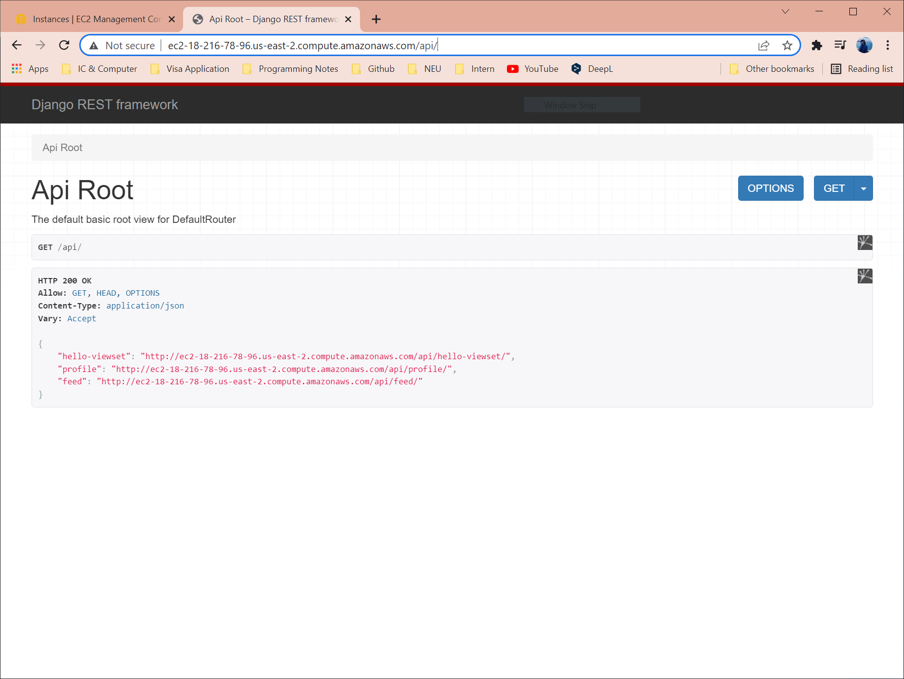
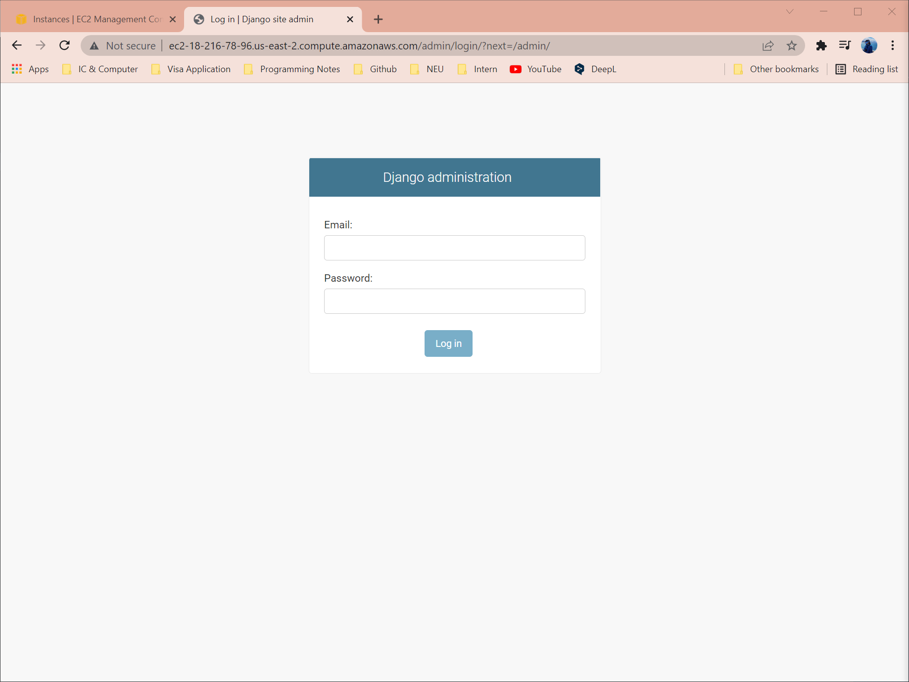
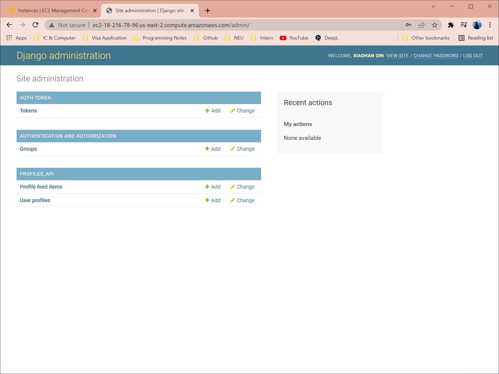

# Profiles REST API
This repo has the source codes for a fully functioning Profiles REST API.

## Description
Built a backend REST API from scratch using Python, Django, Django Rest Framework, Vagrant, Virtual Box ad ModHeaders. Finally deployed the development server to AWS.

## Dependency
The API is made with **Django 2.2** and **Django REST Framework 3.9**.

## Function
The API supports users to:
* Create, update, delete and manage user profiles
* Authenticate with username and password
* Post status updates
* Manage user profile feed items

## API In Action
API root page:
\

Admin page (log in page):
\

Logged in as superuser:
\
